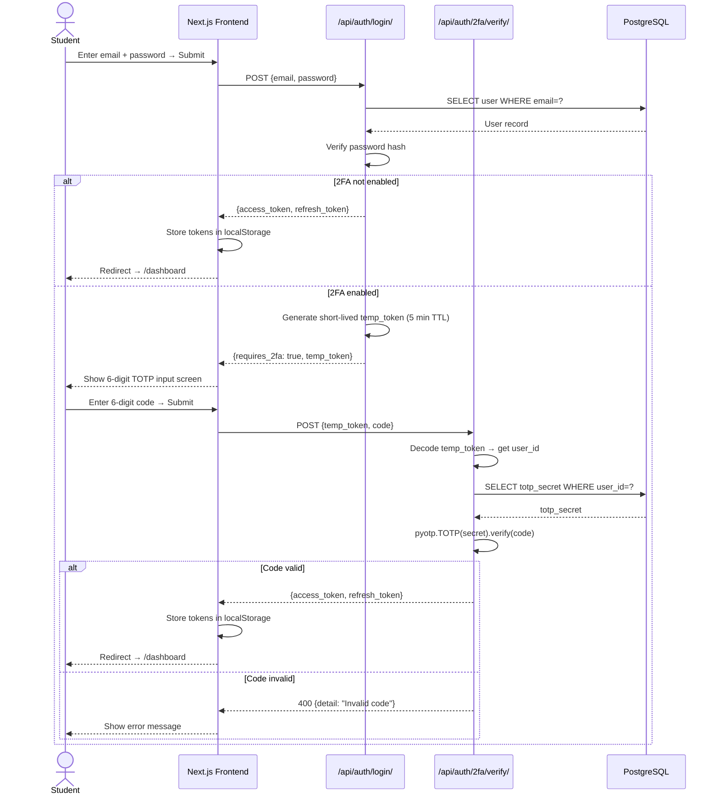
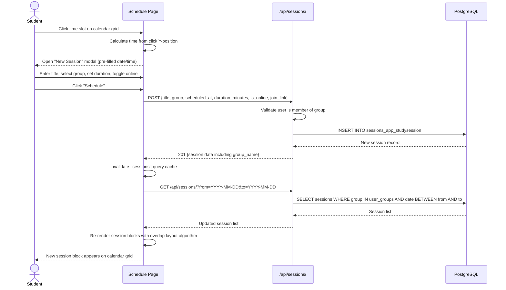
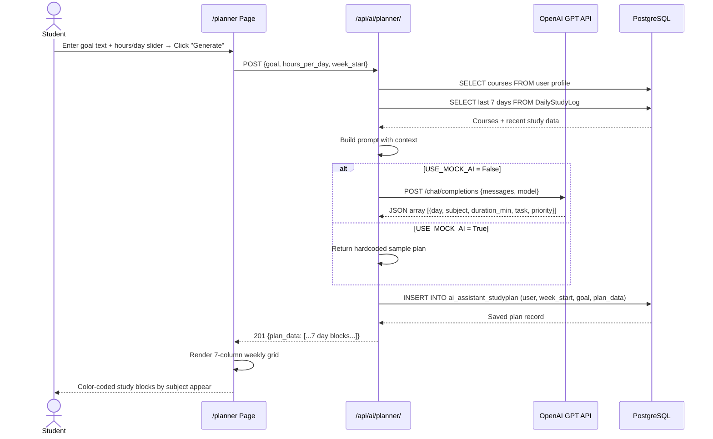
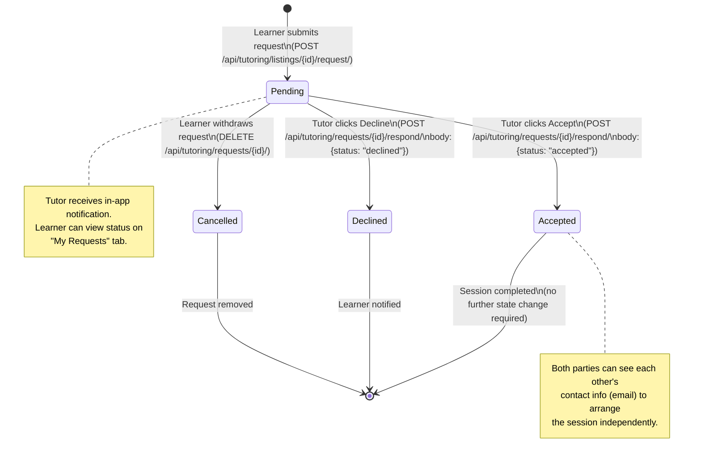
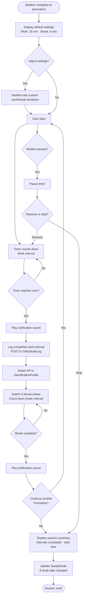

# Assignment 4 — Requirements Modelling & Design
**Project:** StudySync — Collaborative Study Platform  
**Student:** Matin Movahedi

---

## Task 2: Requirements Modelling

---

### 2.1 Structural Model — Domain Class Diagram

The following class diagram captures the core domain entities and their relationships within StudySync.

```mermaid
classDiagram
    direction TB

    class User {
        +int id
        +String email
        +String first_name
        +String last_name
        +String password_hash
        +datetime date_joined
        +boolean is_active
        +login(email, password) Token
        +register(data) User
        +changePassword(old, new) void
    }

    class UserProfile {
        +String university
        +String program
        +String bio
        +String github
        +String linkedin
        +String avatar
        +int total_study_hours
        +int total_sessions
        +List skills
        +List projects
        +boolean email_digest_enabled
        +boolean two_fa_enabled
        +String totp_secret
        +update(data) void
    }

    class StudyGroup {
        +int id
        +String name
        +String category
        +String course_code
        +String description
        +boolean is_private
        +int max_members
        +String avatar_color
        +int member_count
        +addMember(user) void
        +removeMember(user) void
        +isFull() boolean
    }

    class GroupMembership {
        +String role
        +datetime joined_at
    }

    class Message {
        +int id
        +String content
        +String message_type
        +datetime created_at
        +boolean is_deleted
    }

    class StudySession {
        +int id
        +String title
        +datetime scheduled_at
        +int duration_minutes
        +boolean is_online
        +String join_link
        +String location
        +isUpcoming() boolean
    }

    class DailyStudyLog {
        +date date
        +int minutes_studied
        +int sessions_count
        +update(minutes) void
    }

    class StudyStreak {
        +int current_streak
        +int longest_streak
        +date last_study_date
        +update() void
    }

    class GamificationProfile {
        +int xp
        +int level
        +List badges
        +awardXP(amount) void
        +checkLevelUp() void
    }

    class Notification {
        +int id
        +String title
        +String body
        +String notification_type
        +boolean is_read
        +markRead() void
    }

    class Community {
        +int id
        +String name
        +String slug
        +String description
        +String category
        +String icon
        +int member_count
    }

    class Post {
        +int id
        +String title
        +String content
        +String post_type
        +int upvotes
        +datetime created_at
        +upvote(user) void
    }

    class WikiPage {
        +int id
        +String slug
        +String title
        +String content
        +datetime updated_at
        +update(content, user) void
    }

    class Resource {
        +int id
        +String title
        +String description
        +String url
        +String content
        +String category
        +List tags
        +int upvotes
        +boolean is_saved
        +toggleUpvote(user) void
        +toggleSave(user) void
    }

    class TutorListing {
        +int id
        +List subjects
        +String bio
        +String availability
        +boolean is_active
        +deactivate() void
    }

    class TutoringRequest {
        +int id
        +String message
        +String status
        +datetime created_at
        +accept() void
        +decline() void
    }

    class CourseGrade {
        +int id
        +String course_name
        +String target_grade
        +List assessments
        +computeWeightedAverage() float
    }

    class StudyPlan {
        +int id
        +date week_start
        +String goal
        +JSON plan_data
        +generate(goal, hours, courses) StudyPlan
    }

    class CampusSpot {
        +int id
        +String name
        +String building
        +int floor
        +int capacity
        +boolean has_wifi
        +boolean has_outlets
        +String noise_level
    }

    class FocusRoom {
        +int id
        +datetime started_at
        +int duration
    }

    %% Relationships
    User "1" -- "1" UserProfile : has
    User "1" -- "0..*" DailyStudyLog : logs
    User "1" -- "1" StudyStreak : tracks
    User "1" -- "1" GamificationProfile : earns
    User "1" -- "0..*" Notification : receives
    User "0..*" -- "0..*" StudyGroup : joins via GroupMembership
    StudyGroup "1" -- "0..*" Message : contains
    StudyGroup "1" -- "0..*" StudySession : schedules
    StudyGroup "1" -- "0..*" FocusRoom : hosts
    Message "0..*" -- "1" User : sent by
    StudySession "0..*" -- "1" User : created by
    User "0..*" -- "0..*" Community : joins
    Community "1" -- "0..*" Post : contains
    Community "1" -- "0..*" WikiPage : has
    Post "1" -- "0..*" Post : has replies
    Resource "0..*" -- "1" User : created by
    Resource "0..*" -- "0..1" Community : belongs to
    User "1" -- "0..1" TutorListing : offers
    TutorListing "1" -- "0..*" TutoringRequest : receives
    TutoringRequest "0..*" -- "1" User : sent by
    User "1" -- "0..*" CourseGrade : tracks
    User "1" -- "0..*" StudyPlan : generates
    FocusRoom "0..*" -- "1" User : started by
```



---

### 2.2 Sequence Diagrams

#### 2.2.1 UC-02 — Log In with Two-Factor Authentication



---

#### 2.2.2 UC-06 — Schedule a Study Session



---

#### 2.2.3 UC-10 — Generate AI Weekly Study Plan



---

### 2.3 State Diagram — Tutoring Request Lifecycle



---

### 2.4 Activity Diagram — Pomodoro Timer Session



---

## Task 3: Design

---

### 3.1 System Architecture

StudySync follows a **three-tier client-server architecture** with a clear separation between presentation, application logic, and data layers.

```
┌─────────────────────────────────────────────────────────────────────┐
│                        PRESENTATION TIER                            │
│                                                                     │
│   Next.js 16 (App Router)          Deployed on Vercel CDN          │
│   ┌───────────┐  ┌──────────────┐  ┌──────────────────────────┐   │
│   │  Pages    │  │  Components  │  │  State Management        │   │
│   │ /dashboard│  │ GlassCard    │  │  Zustand (authStore,     │   │
│   │ /schedule │  │ Sidebar      │  │  chatStore, notif...)    │   │
│   │ /grades   │  │ Avatar       │  │  React Query (server     │   │
│   │ /tutoring │  │ Button       │  │  state + cache)          │   │
│   │  ...      │  │  ...         │  │                          │   │
│   └───────────┘  └──────────────┘  └──────────────────────────┘   │
└──────────────────────────┬──────────────────────────────────────────┘
                           │ HTTPS (REST)
┌──────────────────────────▼──────────────────────────────────────────┐
│                       APPLICATION TIER                              │
│                                                                     │
│   Django 6 + DRF                     Deployed on Vercel Serverless │
│   ┌────────────────┐  ┌────────────────┐  ┌─────────────────────┐ │
│   │  REST API      │  │  Ably Publish  │  │  Business Logic     │ │
│   │  (WSGI via     │  │  (root key)    │  │  apps/users/        │ │
│   │  ASGI adapter) │  │  chat events   │  │  apps/groups/       │ │
│   │                │  │  focus events  │  │  apps/analytics/    │ │
│   │  JWT Auth      │  │  reactions     │  │  apps/ai_assistant/ │ │
│   │  CORS Headers  │  │                │  │  apps/tutoring/     │ │
│   └────────────────┘  └────────────────┘  └─────────────────────┘ │
│                                │                                    │
│   External Services:     OpenAI GPT API (AI assistant + planner)   │
└──────────────────────────┬──────────────────────────────────────────┘
                           │ TCP/SSL
┌──────────────────────────▼──────────────────────────────────────────┐
│                          DATA TIER                                  │
│                                                                     │
│   PostgreSQL (Neon Serverless)    Vercel Storage Integration        │
│   ┌──────────────────────────────────────────────────────────────┐ │
│   │  13 Django apps × N models each                              │ │
│   │  Connection pooling via PgBouncer (Neon default)             │ │
│   │  Automated backups (Neon managed)                            │ │
│   └──────────────────────────────────────────────────────────────┘ │
└─────────────────────────────────────────────────────────────────────┘
```

**Key architectural decisions:**

| Decision | Choice | Rationale |
|----------|--------|-----------|
| Frontend framework | Next.js App Router | File-based routing, server/client component split, Vercel-native deployment |
| API style | REST + JWT | Stateless, easy to cache, compatible with Vercel serverless |
| Real-time | Ably Pub/Sub | Managed Pub/Sub that works within Vercel's serverless constraint; backend publishes via root key, browser subscribes via subscribe-only key |
| Auth | JWT (simplejwt) | Stateless tokens; no server-side session storage required |
| State | Zustand (client) + React Query (server) | Zustand for UI/auth state; React Query for server data with automatic caching and refetching |
| ORM | Django ORM | Reduces boilerplate; migrations auto-tracked |
| Database | PostgreSQL (Neon) | ACID compliance; JSON field support for flexible data (assessments, plan_data, skills) |

---

### 3.2 Database Design

The entity-relationship diagram below shows the primary tables and their foreign key relationships.

```mermaid
erDiagram
    USER {
        int id PK
        string email UK
        string first_name
        string last_name
        string password_hash
        datetime date_joined
    }

    USER_PROFILE {
        int id PK
        int user_id FK
        string university
        string program
        string bio
        string github
        string linkedin
        string avatar
        int total_study_hours
        int total_sessions
        json skills
        json projects
        bool email_digest_enabled
        bool two_fa_enabled
        string totp_secret
    }

    STUDY_GROUP {
        int id PK
        string name
        string category
        string course_code
        string description
        bool is_private
        int max_members
        string avatar_color
    }

    GROUP_MEMBERSHIP {
        int id PK
        int user_id FK
        int group_id FK
        string role
        datetime joined_at
    }

    MESSAGE {
        int id PK
        int group_id FK
        int sender_id FK
        string content
        string message_type
        datetime created_at
        bool is_deleted
    }

    STUDY_SESSION {
        int id PK
        int group_id FK
        int created_by_id FK
        string title
        datetime scheduled_at
        int duration_minutes
        bool is_online
        string join_link
        string location
    }

    DAILY_STUDY_LOG {
        int id PK
        int user_id FK
        date date
        int minutes_studied
        int sessions_count
    }

    STUDY_STREAK {
        int id PK
        int user_id FK
        int current_streak
        int longest_streak
        date last_study_date
    }

    GAMIFICATION_PROFILE {
        int id PK
        int user_id FK
        int xp
        int level
        json badges
    }

    COMMUNITY {
        int id PK
        string name
        string slug UK
        string description
        string category
        string icon
    }

    POST {
        int id PK
        int community_id FK
        int author_id FK
        int parent_id FK
        string title
        text content
        string post_type
        int upvotes
        datetime created_at
    }

    WIKI_PAGE {
        int id PK
        int community_id FK
        int created_by_id FK
        int updated_by_id FK
        string slug
        string title
        text content
        datetime updated_at
    }

    RESOURCE {
        int id PK
        int created_by_id FK
        int community_id FK
        string title
        text description
        string url
        text content
        string category
        json tags
        int upvotes
    }

    RESOURCE_SAVE {
        int id PK
        int resource_id FK
        int user_id FK
    }

    TUTOR_LISTING {
        int id PK
        int tutor_id FK
        json subjects
        text bio
        string availability
        bool is_active
    }

    TUTORING_REQUEST {
        int id PK
        int requester_id FK
        int listing_id FK
        text message
        string status
        datetime created_at
    }

    COURSE_GRADE {
        int id PK
        int user_id FK
        string course_name
        string target_grade
        json assessments
    }

    STUDY_PLAN {
        int id PK
        int user_id FK
        date week_start
        text goal
        json plan_data
        datetime created_at
    }

    CAMPUS_SPOT {
        int id PK
        string name
        string building
        int floor
        int capacity
        bool has_wifi
        bool has_outlets
        string noise_level
        float latitude
        float longitude
    }

    NOTIFICATION {
        int id PK
        int user_id FK
        string title
        string body
        string notification_type
        bool is_read
        datetime created_at
    }

    USER ||--|| USER_PROFILE : "has"
    USER ||--|| STUDY_STREAK : "tracks"
    USER ||--|| GAMIFICATION_PROFILE : "earns"
    USER ||--o{ DAILY_STUDY_LOG : "logs"
    USER ||--o{ NOTIFICATION : "receives"
    USER ||--o{ STUDY_PLAN : "generates"
    USER ||--o{ COURSE_GRADE : "tracks"
    USER ||--o{ RESOURCE : "creates"
    USER ||--o{ RESOURCE_SAVE : "bookmarks"
    RESOURCE ||--o{ RESOURCE_SAVE : "bookmarked via"
    USER ||--o{ POST : "authors"
    USER ||--o{ MESSAGE : "sends"
    USER ||--o| TUTOR_LISTING : "offers"
    USER ||--o{ TUTORING_REQUEST : "sends"
    GROUP_MEMBERSHIP }o--|| USER : "belongs to"
    GROUP_MEMBERSHIP }o--|| STUDY_GROUP : "in"
    STUDY_GROUP ||--o{ MESSAGE : "contains"
    STUDY_GROUP ||--o{ STUDY_SESSION : "schedules"
    COMMUNITY ||--o{ POST : "has"
    COMMUNITY ||--o{ WIKI_PAGE : "has"
    COMMUNITY ||--o{ RESOURCE : "categorises"
    POST ||--o{ POST : "has replies"
    TUTOR_LISTING ||--o{ TUTORING_REQUEST : "receives"
```



---

### 3.3 Interface Analysis and Design

#### 3.3.1 Interface Inventory

| Screen | Route | Primary Actor Action | Key Components |
|--------|-------|----------------------|----------------|
| Landing page | `/` | Learn about features | Navbar, HeroSection, FeaturesSection, CTASection |
| Login | `/login` | Authenticate | Split-screen layout, email/password form, 2FA challenge |
| Sign Up | `/signup` | Create account | Split-screen layout, registration form |
| Dashboard | `/dashboard` | View overview | Stats bar, groups list, AI copilot card, activity feed |
| Groups Browse | `/groups` | Find/create groups | Search bar, group cards grid, Create modal |
| Group Chat | `/groups/[id]/chat` | Communicate | Message list, real-time input, member sidebar |
| Schedule | `/schedule` | Manage sessions | Time-grid calendar, session blocks, Create/Detail modals |
| Pomodoro | `/pomodoro` | Track focus time | Large countdown display, interval controls |
| AI Assistant | `/ai` | Ask questions | Chat interface, message bubbles, input |
| Study Planner | `/planner` | Generate plan | Goal input, 7-day grid, past plans list |
| Grade Tracker | `/grades` | Track grades | Course cards with assessments, weighted avg display |
| Resource Library | `/resources` | Share/discover | Search, filter chips, resource cards, create modal |
| Tutoring | `/tutoring` | Find/offer tutoring | Tutor cards grid, listing form, request management |
| Analytics | `/analytics` | Review progress | Streak chart, heatmap, study hours graph |
| Profile | `/profile` | View/edit portfolio | Avatar, bio, skills tags, project cards |
| Settings | `/settings` | Configure account | Profile form, 2FA card, email digest toggle |
| Community | `/communities/[slug]` | Participate | Posts feed, wiki tab, post editor |

---

#### 3.3.2 Login Screen

```
┌──────────────────────────────────────────────────────────────────┐
│  LEFT PANEL (dark, branded)      │  RIGHT PANEL (form)           │
│  bg: #0a0a0a                     │                               │
│                                  │   StudySync logo (mobile)     │
│  ⚡ StudySync                    │                               │
│                                  │   Log in to your account      │
│  "Study smarter.                 │   ─────────────────────────   │
│   Graduate stronger."            │                               │
│                                  │   Email                       │
│  ✓ AI-powered study plans        │   [____________________]      │
│  ✓ Group collaboration           │                               │
│  ✓ Progress analytics            │   Password          Forgot?   │
│  ✓ Campus study spots            │   [____________________]      │
│                                  │                               │
│  ────────────────────            │   [  Continue  ──────────]   │
│  12,000+  94%   4.8★             │                               │
│  students pass rate rating       │   ── or use demo ──           │
│                                  │   demo@studysync.app          │
│  ·  ·  ●  ·  ·  (dots)          │   password: demo1234          │
│                                  │                               │
│                                  │   Don't have an account?      │
│                                  │   Sign up →                   │
└──────────────────────────────────┴───────────────────────────────┘

  2FA CHALLENGE STATE (replaces form):
┌─────────────────────────────────┐
│  🛡 Two-factor authentication   │
│  Enter the 6-digit code from    │
│  your authenticator app.        │
│                                 │
│  [  _  _  _  _  _  _  ]        │
│                                 │
│  [ Verify ]   ← Back           │
└─────────────────────────────────┘
```

**Interface design notes:**
- Split-screen is hidden on mobile; only the right panel is shown.
- The "Continue" button is disabled and shows a spinner while the API call is in-flight.
- Password field has a show/hide toggle (eye icon).
- Error messages appear as inline red text below the relevant field, not as modal alerts.

---

#### 3.3.3 Dashboard

```
┌─────────────────────────────────────────────────────────────────┐
│  TOPBAR: avatar · notifications bell · theme toggle             │
├──────────┬──────────────────────────────────────────────────────┤
│ SIDEBAR  │  Good evening                                        │
│          │  Matin                                               │
│ Dashboard│  University of Alberta · CS                          │
│ Schedule │                                                      │
│ Groups   │  🔥 7 day streak · best 12d                          │
│ Planner  │                                                      │
│ Grades   │  ┌────────────┬──────────┬──────────┬─────────────┐ │
│ AI       │  │ 42 hrs     │ 3 active │ 18 done  │ ▓▓▓▒ Lvl 5 │ │
│ Tutoring │  │ Study hours│ Groups   │ Sessions │ XP progress │ │
│ Resources│  └────────────┴──────────┴──────────┴─────────────┘ │
│ Analytics│                                                      │
│ ...      │  ┌── My Groups ──────────────────┐  ┌── AI ───────┐ │
│          │  │ # MATH201 Study Group  2 online│  │ Ask me      │ │
│          │  │ # CS401 Algorithms             │  │ anything... │ │
│          │  │ # Biology Prep                 │  │             │ │
│          │  │ Browse all →                   │  │  [Input] ▶  │ │
│          │  └────────────────────────────────┘  └────────────┘ │
│          │                                                      │
│          │  ┌── Recent Activity ─────────────┐                 │
│          │  │ ● Session completed              │                 │
│          │  │ ● Joined CS401 group             │                 │
│          │  └──────────────────────────────────┘                │
└──────────┴──────────────────────────────────────────────────────┘
```

**Interface design notes:**
- The stats bar uses a single border-separated row (no cards) for visual density.
- Clicking the XP cell navigates to `/leaderboard`.
- The AI Copilot card is a condensed version of the full AI page; submitting navigates to `/ai` with the question pre-filled.
- Groups list shows real-time online presence (green dot + count) via Ably presence.

---

#### 3.3.4 Schedule Calendar

```
┌───────────────────────────────────────────────────────────────────┐
│  Schedule   ‹ May 26 – Jun 1 ›   Today             [+]           │
├───────────────────────────────────────────────────────────────────┤
│        │  MON    TUE    WED    THU    FRI    SAT    SUN          │
│        │   26     27     28     29     30     31      1          │
├───┬────┴────────────────────────────────────────────────────────── │
│ 8a│    │                                                           │
│───┤    │  ┌─────┐                                                  │
│10a│    │  │MATH │                                                  │
│───┤    │  │Study│        ┌───────┐                                 │
│12p│    │  │Group│        │CS401  │                                 │
│───┤    │  │10–11│        │12–1pm │                                 │
│ 2p│    │  └─────┘        └───────┘                                 │
│───┤    │                              ┌──────┐                     │
│ 4p│    │                              │Bio   │                     │
│───┤    │                              │Prep  │                     │
│ 6p│    │                              └──────┘                     │
│───┤    │                                                           │
│ 8p│    │                                                           │
│───┴────────────────────────────────────────────────────────────── │
│  ← click any empty slot to schedule a new session                 │
└───────────────────────────────────────────────────────────────────┘

SESSION BLOCK (hovered):           DETAIL MODAL:
┌────────────────┐                 ┌──────────────────────────┐
│ MATH Study     │                 │ MATH Study Group    [×]  │
│ Group          │ → click →       │ Tuesday, May 27 · 10:00AM│
│ 10:00 AM       │                 │ 60 min · MATH201 Group   │
└────────────────┘                 │                          │
(colored title, neutral bg)        │ Join ↗           Delete  │
                                   └──────────────────────────┘
```

**Interface design notes:**
- Each hour row is 40 px tall; 15 hours (7 am–10 pm) = 600 px total, scrollable.
- Session blocks are positioned absolutely using CSS custom properties (`--s-top`, `--s-height`).
- Overlapping sessions are placed side-by-side using the column-assignment algorithm.
- The current-time indicator is a brand-coloured horizontal line with a dot on the left edge.
- Today's column has a very subtle brand tint (`bg-brand/1.5%`).

---

#### 3.3.5 Grade Tracker

```
┌──────────────────────────────────────────────────────────────────┐
│  Grade Tracker                                   [+ Add Course]  │
│                                                                  │
│  ┌── MATH 201 ─────────────────────────────────────────────┐    │
│  │  Target: A                                               │    │
│  │                                                          │    │
│  │  87.4%   ▓▓▓▓▓▓▓▓▓▓▓▓▓▓▓▒▒▒░░░░  → A target            │    │
│  │  (cyan — above 80%)                                      │    │
│  │                                                          │    │
│  │  Assessment        Score    Weight   Type                │    │
│  │  Assignment 1      88/100   15%      assignment          │    │
│  │  Midterm           79/100   30%      midterm             │    │
│  │  Assignment 2      95/100   15%      assignment          │    │
│  │  [+ Add Assessment]                                      │    │
│  └──────────────────────────────────────────────────────────┘    │
│                                                                  │
│  ┌── CS 401 ───────────────────────────────────────────────┐    │
│  │  Target: A+                                              │    │
│  │  92.1%   ▓▓▓▓▓▓▓▓▓▓▓▓▓▓▓▓▓▓▓▒░  (green — above 90%)   │    │
│  │  ...                                                     │    │
│  └──────────────────────────────────────────────────────────┘    │
└──────────────────────────────────────────────────────────────────┘
```

**Weighted average formula displayed inline:**
`Σ(score ÷ max_score × weight) ÷ Σ(weight) × 100`

**Colour coding:**
- ≥ 90% → `text-brand` (green)
- ≥ 80% → `text-cyan-400`
- ≥ 70% → `text-amber-400`
- < 70%  → `text-rose-400`

---

#### 3.3.6 Tutoring Marketplace

```
┌──────────────────────────────────────────────────────────────────┐
│  Tutoring              [Find a Tutor]  [My Listings & Requests]  │
│                                                                  │
│  Search by subject: [MATH201____________]  [Search]              │
│                                                                  │
│  ┌─────────────────────┐  ┌─────────────────────┐               │
│  │  👤 Alex C.         │  │  👤 Sara M.          │               │
│  │  MATH201  CS301     │  │  BIO201  CHEM101     │               │
│  │  "Strong in linear  │  │  "Pre-med tutor,     │               │
│  │  algebra and calc"  │  │  4.0 GPA student"    │               │
│  │  Avail: evenings    │  │  Avail: weekends     │               │
│  │  [Request Session]  │  │  [Request Session]   │               │
│  └─────────────────────┘  └─────────────────────┘               │
│                                                                  │
│  MY LISTINGS & REQUESTS TAB:                                     │
│  ┌───────────────────────────────────────────────────────────┐  │
│  │  Your Listing                               [Edit] [Del]  │  │
│  │  Subjects: MATH201, CS301                                 │  │
│  │  Incoming Requests (2)                                    │  │
│  │  ● Jamie B. — "Need help with matrix transformations"     │  │
│  │    [Accept]  [Decline]                                    │  │
│  └───────────────────────────────────────────────────────────┘  │
└──────────────────────────────────────────────────────────────────┘
```

---

### 3.4 Deployment Diagram

The deployment diagram below shows the physical distribution of software components across execution environments for the production system.

```
┌─────────────────────────────────────────────────────────────────────────────┐
│  USER DEVICE  (browser / mobile browser)                                    │
│  ┌──────────────────────────────────────┐                                   │
│  │  Next.js React App (client bundle)   │                                   │
│  │  - Zustand state stores              │                                   │
│  │  - React Query cache                 │                                   │
│  │  - localStorage (JWT tokens)         │                                   │
│  └──────────┬───────────────────────────┘                                   │
└─────────────┼───────────────────────────────────────────────────────────────┘
              │ HTTPS / WSS
   ┌──────────▼────────────────────────────────────────────────────────────┐
   │  VERCEL EDGE NETWORK  (CDN + Serverless Runtime)                      │
   │                                                                        │
   │  ┌─────────────────────────────────┐  ┌───────────────────────────┐  │
   │  │  Frontend Project               │  │  Backend Project           │  │
   │  │  studysync-frontend-delta       │  │  studysync-backend-rho     │  │
   │  │  .vercel.app                    │  │  .vercel.app               │  │
   │  │                                 │  │                            │  │
   │  │  Runtime: Node.js 20 (Next.js)  │  │  Runtime: Python 3.12      │  │
   │  │  Build: Turbopack               │  │  Entry: api/index.py       │  │
   │  │  Static: CDN-cached per route   │  │  WSGI via ASGI adapter     │  │
   │  │                                 │  │                            │  │
   │  │  Env vars:                      │  │  Env vars:                 │  │
   │  │  NEXT_PUBLIC_API_URL            │  │  SECRET_KEY                │  │
   │  │  NEXT_PUBLIC_ABLY_KEY           │  │  POSTGRES_URL              │  │
   │  └─────────────────────────────────┘  │  CORS_ALLOWED_ORIGINS      │  │
   │                                        │  ABLY_API_KEY              │  │
   │                                        │  USE_MOCK_AI               │  │
   │                                        └──────────┬─────────────────┘  │
   └──────────────────────────────────────────────────┼────────────────────┘
                                                       │ SSL/TCP (pg wire)
   ┌───────────────────────────────────────────────────▼────────────────────┐
   │  NEON SERVERLESS POSTGRES  (Vercel Storage Integration)                │
   │                                                                         │
   │  Host: ep-*.us-east-2.aws.neon.tech                                    │
   │  Pooler: PgBouncer (connection pooling for serverless)                 │
   │  Plan: Free tier (0.5 GB storage, auto-suspend on idle)                │
   │  Backups: Neon managed, point-in-time recovery                         │
   │  Schema: 19 Django-managed tables across 13 application domains        │
   └─────────────────────────────────────────────────────────────────────────┘
                                                       │ HTTPS
   ┌───────────────────────────────────────────────────▼────────────────────┐
   │  OPENAI API  (External Service)                                         │
   │  Endpoint: api.openai.com/v1/chat/completions                          │
   │  Used by: AI assistant chat, weekly study plan generation              │
   │  Fallback: Mock responses when USE_MOCK_AI=True                        │
   └─────────────────────────────────────────────────────────────────────────┘
```

**Deployment notes:**
- The frontend is statically pre-rendered at build time for most routes (29 of 29 routes compiled). Dynamic routes (`/groups/[groupId]`, `/profile/[userId]`) are server-rendered on demand.
- The backend runs as a serverless Python WSGI function. On cold start (first request after idle), Django migrations are executed automatically via `call_command('migrate')` in `api/index.py`.
- Real-time features (chat, reactions, typing indicators, focus room presence) are delivered via Ably Pub/Sub. The backend holds a root API key used to publish events; the browser subscribes directly to Ably channels using a subscribe-only key. This design is fully compatible with Vercel's stateless serverless runtime — no persistent connection to the backend is required.
- The Neon database auto-suspends after 5 minutes of inactivity on the free tier, causing a ~1-second cold-start delay on the next query.

---

### 3.5 Django Application Component Diagram

StudySync's backend is decomposed into 13 Django application modules, each owning its domain's models, serializers, views, and URL patterns.

```
┌─────────────────────────────────────────────────────────────────────────────┐
│  config/  — Project configuration                                           │
│  ┌──────────┐  ┌──────────────┐  ┌────────────────────────────────────┐   │
│  │ settings/ │  │   urls.py    │  │  asgi.py                           │   │
│  │ base.py   │  │ (root router)│  │  ProtocolTypeRouter                │   │
│  │ dev.py    │  │              │  │  ├── HTTP → WSGI (api/index.py)    │   │
│  │ prod.py   │  │              │  │  └── WS → AllowedHostsOriginVal... │   │
│  └──────────┘  └──────────────┘  └────────────────────────────────────┘   │
└─────────────────────────────────────────────────────────────────────────────┘

┌──────────────────────────────────────────────────────────────────────────────┐
│  apps/  — Domain application modules                                         │
│                                                                               │
│  ┌────────────────┐   ┌─────────────────┐   ┌──────────────────────────┐   │
│  │  users         │   │  groups         │   │  chat                    │   │
│  │  ─────────     │   │  ────────       │   │  ────                    │   │
│  │  User (custom) │◄──│  StudyGroup     │◄──│  Message                 │   │
│  │  UserProfile   │   │  GroupMembership│   │  FocusRoom               │   │
│  │  2FA views     │   │  REST CRUD      │   │  MessageListCreateView   │   │
│  │  Auth views    │   │  join/leave     │   │  Ably publish (root key) │   │
│  │  weekly digest │   │  invite links   │   │  reactions, typing       │   │
│  └────────┬───────┘   └────────┬────────┘   └──────────────────────────┘   │
│           │                    │                                              │
│  ┌────────▼───────┐   ┌────────▼────────┐   ┌──────────────────────────┐   │
│  │  notifications │   │  sessions_app   │   │  analytics               │   │
│  │  ─────────     │   │  ────────────── │   │  ─────────               │   │
│  │  Notification  │   │  StudySession   │   │  DailyStudyLog           │   │
│  │  REST API      │   │  date-range     │   │  StudyStreak             │   │
│  │  dismiss/clear │   │  filter API     │   │  CourseGrade             │   │
│  └────────────────┘   └─────────────────┘   │  weighted avg calc       │   │
│                                               └──────────────────────────┘   │
│  ┌────────────────┐   ┌─────────────────┐   ┌──────────────────────────┐   │
│  │  ai_assistant  │   │  communities    │   │  gamification            │   │
│  │  ────────────  │   │  ───────────    │   │  ─────────────           │   │
│  │  AIConversation│   │  Community      │   │  GamificationProfile     │   │
│  │  StudyPlan     │   │  Post           │   │  XP / level / badges     │   │
│  │  OpenAI client │   │  WikiPage       │   │  leaderboard API         │   │
│  │  mock fallback │   │  post/wiki views│   └──────────────────────────┘   │
│  └────────────────┘   └─────────────────┘                                   │
│                                                                               │
│  ┌────────────────┐   ┌─────────────────┐   ┌──────────────────────────┐   │
│  │  resources     │   │  tutoring       │   │  campus                  │   │
│  │  ─────────     │   │  ────────       │   │  ──────                  │   │
│  │  Resource      │   │  TutorListing   │   │  CampusSpot              │   │
│  │  ResourceVote  │   │  TutoringRequest│   │  map/search API          │   │
│  │  ResourceSave  │   │  accept/decline │   └──────────────────────────┘   │
│  │  search/filter │   │                 │                                   │
│  └────────────────┘   └─────────────────┘                                   │
└──────────────────────────────────────────────────────────────────────────────┘

Inter-module dependencies (import direction):
  chat      → groups (StudyGroup FK)
  chat      → users  (sender FK)
  sessions  → groups (StudyGroup FK)
  analytics → users  (user FK)
  resources → communities (community FK, optional)
  resources → users  (created_by FK)
  tutoring  → users  (tutor, requester FKs)
  communities → users (author FKs)
  notifications → users (user FK)
  gamification → users (user FK, OneToOne)
```

---

### 3.6 Component and API Design

#### 3.6.1 REST API Endpoint Summary

| Method | Endpoint | Description |
|--------|----------|-------------|
| POST | `/api/auth/login/` | Authenticate; returns tokens or 2FA challenge |
| POST | `/api/auth/register/` | Create account |
| POST | `/api/auth/refresh/` | Rotate JWT tokens |
| POST | `/api/auth/2fa/verify/` | Verify TOTP code after login |
| GET/PUT | `/api/users/profile/` | Read or update own profile |
| GET/PUT | `/api/users/2fa/setup/` | Get QR code for 2FA setup |
| POST | `/api/users/2fa/enable/` | Activate 2FA with verified code |
| POST | `/api/users/2fa/disable/` | Deactivate 2FA |
| GET/POST | `/api/groups/` | List all groups / create group |
| GET | `/api/groups/my/` | List user's own groups |
| GET | `/api/groups/{id}/` | Group detail |
| POST | `/api/groups/{id}/join/` | Join a group |
| POST | `/api/groups/{id}/leave/` | Leave a group |
| GET | `/api/groups/{id}/members/` | List group members |
| GET/POST | `/api/sessions/` | List/create study sessions (supports `?from&to` filter) |
| DELETE | `/api/sessions/{id}/` | Delete a session |
| GET/POST | `/api/analytics/grades/` | List/create courses in grade tracker |
| PUT/DELETE | `/api/analytics/grades/{id}/` | Update or delete a course |
| GET/POST | `/api/resources/` | Browse / share resources |
| POST | `/api/resources/{id}/vote/` | Toggle upvote on a resource |
| POST | `/api/resources/{id}/save/` | Toggle bookmark on a resource |
| GET | `/api/groups/invite/{code}/` | Get group info by invite code (no auth) |
| POST | `/api/groups/invite/{code}/` | Join group by invite code |
| PATCH | `/api/ai/flashcards/{id}/` | Increment flashcard review_count |
| DELETE | `/api/notifications/{id}/` | Dismiss notification |
| POST | `/api/notifications/clear/` | Clear all read notifications |
| GET/POST | `/api/tutoring/listings/` | Browse tutors / create listing |
| POST | `/api/tutoring/listings/{id}/request/` | Send tutoring request |
| GET | `/api/tutoring/requests/incoming/` | Tutor's incoming requests |
| POST | `/api/tutoring/requests/{id}/respond/` | Accept or decline request |
| POST | `/api/ai/chat/` | Send message to AI assistant |
| GET/POST | `/api/ai/planner/` | List past plans / generate new plan |
| GET/POST | `/api/communities/{slug}/wiki/` | List / create wiki pages |
| GET/PUT | `/api/communities/{slug}/wiki/{pageSlug}/` | Read / edit wiki page |
| GET | `/api/analytics/streak/` | Fetch current streak |
| GET | `/api/analytics/daily-logs/` | Fetch daily study log history |

**Real-time (Ably Pub/Sub Channels):**

| Channel | Direction | Purpose |
|---------|-----------|---------|
| `chat-{group_id}` | Backend publishes, browser subscribes | Group chat messages, reactions, typing indicators |
| `focus-{room_id}` | Ably presence | Focus room join/leave events |

---

#### 3.6.2 Key Algorithms

**Session Overlap Detection (Schedule Calendar)**

When rendering sessions for a single day, the algorithm assigns each session to a column so that overlapping sessions appear side-by-side rather than on top of each other.

```
Algorithm layoutDay(sessions):
  sorted ← sessions sorted by scheduled_at ascending
  columns ← []  // each entry = end_time of last session in that column
  placed  ← []

  for each session s in sorted:
    start ← parseISO(s.scheduled_at).getTime()
    end   ← start + s.duration_minutes × 60000
    col   ← first index i where columns[i] ≤ start
    if no such index:
      col ← columns.length
      columns.append(0)
    columns[col] ← end
    placed.append({ session: s, col: col })

  totalCols ← max(1, columns.length)
  for each p in placed:
    p.width ← 100% / totalCols
    p.left  ← (p.col / totalCols) × 100%

  return placed
```

**Weighted Grade Average**

```
Algorithm computeWeightedAverage(assessments):
  numerator   ← 0
  denominator ← 0
  for each a in assessments:
    pct          ← a.score / a.max_score
    numerator   += pct × a.weight
    denominator += a.weight
  if denominator = 0: return null
  return (numerator / denominator) × 100
```

---

## Reflection

### How the Project Went

The StudySync project was one of the most demanding but rewarding experiences of this course. Starting from an initial concept — a collaborative study tool for university students — the scope grew significantly as I identified just how many interconnected problems students face: scheduling conflicts, lack of accountability, difficulty finding tutors, and scattered resources. By the end of the development phase, StudySync comprised fifteen distinct feature areas, a thirteen-app Django backend, and a Next.js frontend with twenty-nine routes.

The early requirements modelling phase proved its value during implementation in ways I did not fully anticipate. When I sat down to write the use case descriptions for Assignment 3, I was forced to think through edge cases — such as what happens when a tutoring request is sent twice to the same tutor, or what the system should display when a user's grade weights exceed 100%. Having those alternative flows documented meant that when I built those components, I already had clear decisions to follow rather than making them ad hoc. The use case descriptions essentially became my acceptance criteria.

The most technically challenging part was the calendar scheduling feature. A time-grid layout with dynamic pixel positioning, overlap detection, click-to-schedule interaction, and live session loading from a date-range API all had to work together. Early iterations used inline styles for positioning, which triggered linter errors. The solution — CSS custom properties consumed by named CSS classes — was non-obvious but elegant, and taught me a lot about the boundary between CSS and JavaScript. Similarly, the session overlap detection algorithm went through three iterations before arriving at the column-assignment approach that handled all edge cases correctly.

Deployment introduced unexpected complexity. The project was initially designed with Django Channels for real-time chat, but Vercel's serverless Python runtime does not support persistent WebSocket connections. Discovering this after deployment forced a full replacement of the real-time layer: chat, reactions, typing indicators, and focus room presence were re-architected to use Ably Pub/Sub. The backend now publishes events to Ably channels using a root API key; the browser subscribes directly using a subscribe-only key, with no persistent connection to the Django backend required. This re-architecture resolved the production gap and the features are now fully functional on the live deployment. Had the deployment target been evaluated against real-time requirements earlier in the project, the initial architecture would have been designed around Ably from the start rather than requiring a mid-stream replacement.

### What I Learned

The most important lesson was the value of modelling before building. Class diagrams forced me to think about data ownership: for example, whether `TutoringRequest` should carry a foreign key to `TutorListing` (rather than directly to the tutor's user) became obvious when drawing the relationship. That one structural decision meant I could later filter incoming requests per listing and check for duplicates with a simple database query. Had I skipped the modelling phase, I likely would have designed the data schema differently and refactored it later at higher cost.

I also developed a much clearer intuition for separating server state from client state. Using React Query for API data and Zustand for local UI state (authentication tokens, real-time chat messages, gamification progress) kept the code predictable. Bugs that would have been hard to trace in a monolithic state store were easy to isolate because each state domain had a single, clear owner.

The project also exposed me to practical deployment and infrastructure concerns that coursework rarely covers: environment variable management across multiple services, database connection pooling, cold-start migration strategies, CORS configuration between a frontend domain and an API domain, and the trade-offs between monolithic and serverless hosting models.

### What I Would Do Differently

**Plan the deployment architecture from day one.** The choice to use Django Channels for real-time features was made without seriously evaluating the deployment target. When Vercel's serverless runtime proved incompatible with persistent WebSocket connections, the real-time layer had to be fully replaced with Ably Pub/Sub mid-project. A production-first mindset would have surfaced this constraint earlier and the architecture would have been designed around a managed Pub/Sub service from the start, avoiding the rework.

**Scope more aggressively.** The fifteen feature areas delivered a comprehensive platform, but each feature had rough edges because the time budget was spread thin. If I were to do this again, I would deliver eight features with thorough edge-case handling and automated tests rather than fifteen features with minimal error handling in the less-used paths.

**Write integration tests alongside features.** Every feature was manually verified during development, but none had automated tests. When a change to the sessions API broke the dashboard page's session count display, it was discovered manually rather than by a failing test. A suite of pytest integration tests against a test database would have caught several regressions earlier and given me greater confidence when refactoring shared utilities.

**Model the interface earlier.** Interface wireframes were produced after the fact for this assignment. In practice, drawing the schedule calendar wireframe before writing any code would have surfaced the CSS positioning challenge at planning time rather than implementation time, allowing me to research solutions without blocking forward progress on the feature.

Overall, StudySync was a project I am genuinely proud of. It solves a real problem, uses a modern and coherent technology stack, and is live on a public URL. The gap between the clean model in a class diagram and the messy reality of a working deployed system is exactly the kind of knowledge that cannot be learned from reading alone.

---

*End of Assignment 4*
