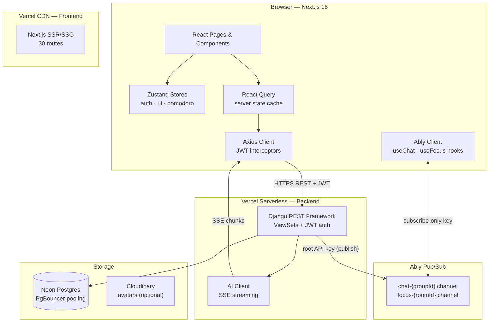
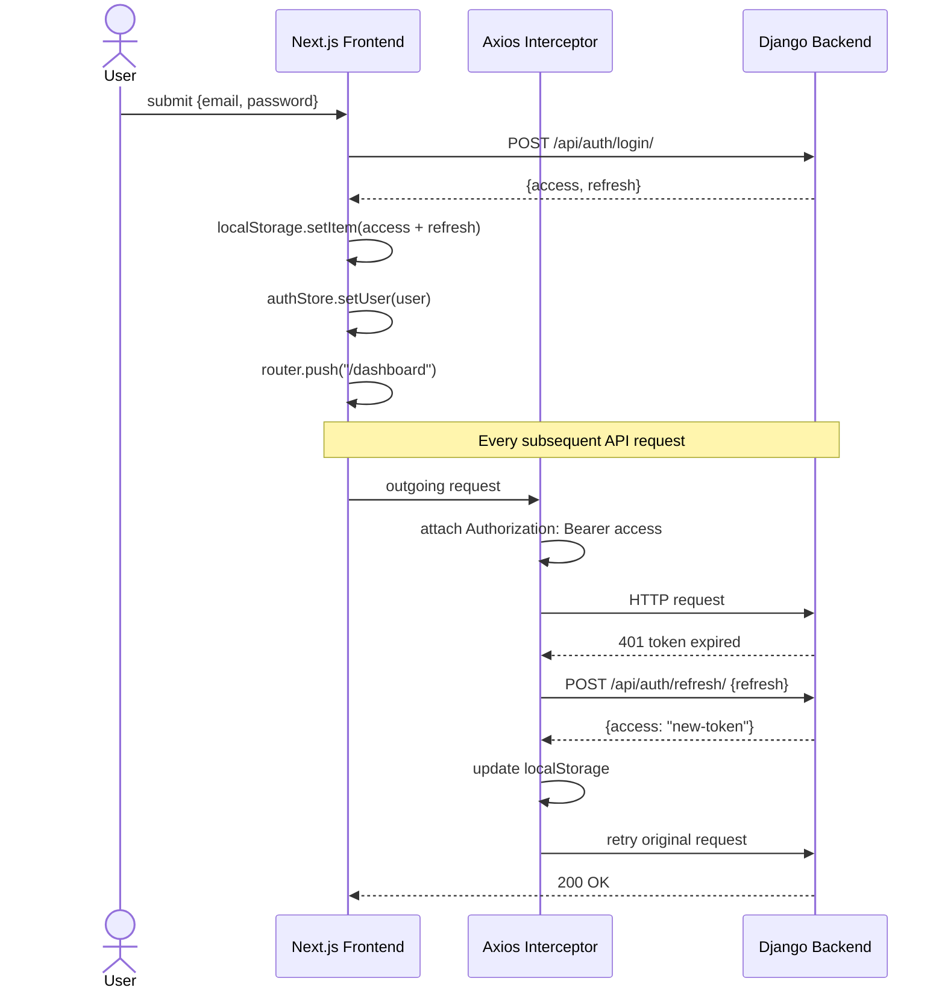
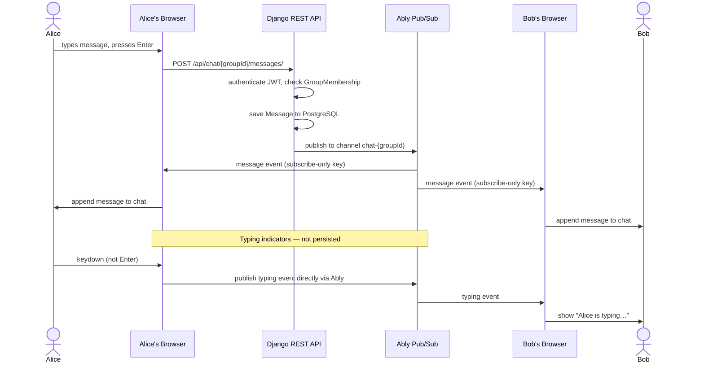
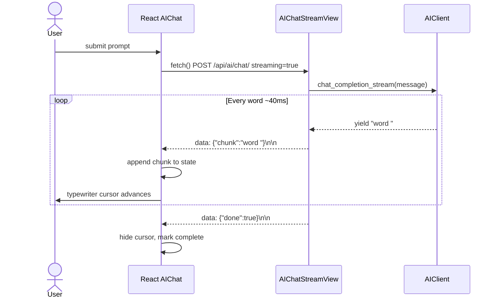
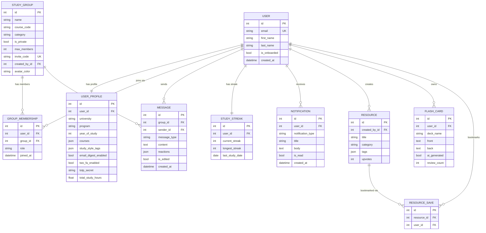

# StudySync

AI-powered collaborative study platform. Full-stack: Django 6 REST API (backend) · Next.js 16 + Tailwind v4 (frontend).

Live: **[studysynch.org](https://studysynch.org)**

---

## Features

**Groups & Collaboration**
- Create and join study groups with course codes, categories, and privacy settings
- Real-time group chat via Ably Pub/Sub with typing indicators and emoji reactions
- Collaborative whiteboard per group (Excalidraw + Ably sync, 5 s auto-save)
- Invite links that land on a group join page — no account required to preview
- Members sidebar, role badges (admin / member), and leave confirmation

**AI Study Tools**
- Streaming AI chat with typewriter effect (mock by default; wired to OpenAI when configured)
- Quiz generator — topic + difficulty, multiple-choice with explanations
- Flashcard generator with 3D flip animation, spaced-repetition review mode, and per-card delete
- Note summarizer and concept explainer
- AI weekly study plan generator — produces a colour-coded 7-day grid from a goal + hours/day

**Focus & Productivity**
- Pomodoro timer with configurable work/break intervals, sound notifications, and session logging
- Focus Rooms (Ably presence) — drop into a virtual shared study space with other students
- Weekly time-grid calendar for scheduling and browsing study sessions with overlap detection

**Analytics & Progress**
- Study streak tracker, longest streak, total hours, and daily study log
- 7-day area chart and 30-day bar chart of study minutes
- Subject breakdown pie chart
- Grade tracker — add courses and assessments; system calculates weighted averages with colour-coded feedback

**Community & Discovery**
- Topic-based communities with a posts/comments feed and upvoting
- Community wiki — collaborative markdown pages with live-edit
- Resource library — share links and notes, categorise, tag, upvote, and bookmark
- Peer tutoring marketplace — list yourself as a tutor or send tutoring requests
- Campus study spots directory with ratings, amenities, noise levels, and hours

**User & Settings**
- Onboarding flow — university, program, study style, courses
- Public portfolio with skills, projects, GitHub, and LinkedIn links
- Two-Factor Authentication (TOTP) via authenticator app
- Weekly email digest summarising study activity
- Notification centre with per-notification dismiss and clear-read controls
- Dark / light mode with zero flash
- Gamification — XP, levels, and leaderboard
- Fully responsive — collapsible sidebar on desktop, bottom tab bar on mobile

---

## Tech Stack

| Layer | Technology |
|---|---|
| Frontend | Next.js 16 · React 19 · TypeScript · Tailwind CSS v4 |
| State | Zustand (client) · React Query (server cache) |
| Animations | Framer Motion |
| Backend | Django 6 · Django REST Framework 3.17 |
| Auth | JWT (simplejwt) · localStorage · Axios interceptors with auto-refresh |
| Real-time | Ably Pub/Sub — root key on backend for publish; subscribe-only key on browser |
| Database | PostgreSQL (Neon Serverless) |
| AI | Mocked SSE streaming by default — set `USE_MOCK_AI = False` + `OPENAI_API_KEY` for real OpenAI |
| Storage | Cloudinary (optional) for avatar persistence |

---

## Project Structure

```
410Project/
├── studysync-backend/
│   ├── apps/
│   │   ├── users/          # Custom User, UserProfile, 2FA, auth, weekly digest
│   │   ├── groups/         # StudyGroup, GroupMembership, invite links
│   │   ├── chat/           # Message, reactions (Ably publish + REST history)
│   │   ├── sessions_app/   # StudySession, PomodoroSession
│   │   ├── ai_assistant/   # AIConversation, FlashCard, StudyPlan, streaming
│   │   ├── analytics/      # StudyStreak, DailyStudyLog, CourseGrade
│   │   ├── campus/         # CampusSpot
│   │   ├── notifications/  # Notification (REST + dismiss/clear)
│   │   ├── communities/    # Community, Post, Comment, WikiPage
│   │   ├── resources/      # Resource, ResourceVote, ResourceSave
│   │   ├── tutoring/       # TutorListing, TutoringRequest
│   │   └── gamification/   # GamificationProfile, XP, leaderboard
│   ├── config/             # Django settings, URL root
│   ├── api/                # Vercel serverless entry point (api/index.py)
│   ├── fixtures/           # Seed data
│   └── requirements.txt
│
└── studysync-frontend/
    ├── app/
    │   ├── (auth)/         # login, signup — AnimatedBackground layout
    │   ├── (dashboard)/    # dashboard, groups, ai, pomodoro, analytics,
    │   │                   # profile, settings, spots, grades, planner,
    │   │                   # tutoring, resources, communities, focus
    │   ├── onboarding/
    │   ├── pricing/
    │   └── not-found.tsx
    ├── components/
    │   ├── landing/        # Navbar, Hero, Features, HowItWorks, Testimonials, CTA
    │   ├── layout/         # Sidebar, Topbar, MobileNav
    │   ├── shared/         # GlassCard, AnimatedBackground, GradientText,
    │   │                   # PostCard, CommentThread
    │   └── ui/             # Button, Avatar, Badge, Input, Skeleton, ThemeToggle
    ├── hooks/              # usePomodoro, useChat (Ably), useFocus
    ├── lib/
    │   ├── api/            # Axios client + per-domain API modules
    │   ├── store/          # Zustand stores (auth, ui, pomodoro, notifications)
    │   └── utils/          # cn, format, animations
    └── public/
```

---

## Running Locally

### Prerequisites

- Python 3.11+
- Node.js 20+
- [Postgres.app](https://postgresapp.com) (or any PostgreSQL instance)
- An [Ably](https://ably.com) free account for real-time features

### 1 — Database

```bash
# Start Postgres.app, then create the database
psql -c "CREATE DATABASE studysync;"
```

### 2 — Backend

```bash
export PATH="/Applications/Postgres.app/Contents/Versions/latest/bin:$PATH"

python -m venv venv
source venv/bin/activate
pip install -r studysync-backend/requirements.txt

cd studysync-backend
python manage.py migrate
python manage.py loaddata fixtures/*.json   # optional seed data
python manage.py runserver 8000
```

### 3 — Frontend

```bash
cd studysync-frontend
npm install
npm run dev          # http://localhost:3000
```

### Demo credentials

```
Email:    alex@university.edu
Password: StudySync2024!
```

---

## Environment Variables

### Backend

| Variable | Default | Description |
|---|---|---|
| `SECRET_KEY` | insecure dev key | Django secret key |
| `DEBUG` | `True` | Debug mode |
| `DATABASE_URL` | — | PostgreSQL connection URL |
| `USE_MOCK_AI` | `True` | Use mock SSE responses instead of OpenAI |
| `OPENAI_API_KEY` | — | Required when `USE_MOCK_AI = False` |
| `ABLY_API_KEY` | — | Root Ably API key for publishing chat and focus events |
| `CLOUDINARY_URL` | — | Optional; enables persistent avatar uploads |

### Frontend

| Variable | Default | Description |
|---|---|---|
| `NEXT_PUBLIC_API_URL` | `http://localhost:8000` | Backend API base URL |
| `NEXT_PUBLIC_ABLY_KEY` | — | Ably subscribe-only key for browser clients |

---

## API Overview

All endpoints are under `/api/`. JWT access token required in `Authorization: Bearer <token>` header unless noted.

| Method | Path | Description |
|---|---|---|
| POST | `/api/auth/register/` | Sign up |
| POST | `/api/auth/login/` | Log in → `{access, refresh}` or 2FA challenge |
| POST | `/api/auth/refresh/` | Refresh access token |
| POST | `/api/auth/2fa/verify/` | Verify TOTP code after 2FA challenge |
| GET | `/api/users/me/` | Current user profile |
| PATCH | `/api/users/profile/` | Update profile |
| GET/PUT | `/api/users/2fa/setup/` | 2FA QR code setup |
| POST | `/api/users/2fa/enable/` | Activate 2FA with verified code |
| POST | `/api/users/2fa/disable/` | Deactivate 2FA |
| GET/POST | `/api/groups/` | List / create study groups |
| GET | `/api/groups/my/` | Current user's groups |
| GET | `/api/groups/:id/` | Group detail |
| POST | `/api/groups/:id/join/` | Join a group |
| POST | `/api/groups/:id/leave/` | Leave a group |
| GET | `/api/groups/:id/members/` | List group members |
| GET | `/api/groups/invite/:code/` | Group info by invite code (no auth) |
| POST | `/api/groups/invite/:code/` | Join group by invite code |
| GET | `/api/chat/:id/messages/` | Fetch message history |
| POST | `/api/ai/chat/` | Streaming AI chat (SSE) |
| POST | `/api/ai/quiz/` | Generate quiz |
| GET/POST | `/api/ai/flashcards/` | List / generate flashcards |
| PATCH | `/api/ai/flashcards/:id/` | Increment flashcard `review_count` |
| DELETE | `/api/ai/flashcards/:id/` | Delete flashcard |
| POST | `/api/ai/summarize/` | Summarize notes |
| POST | `/api/ai/explain/` | Explain a concept |
| GET/POST | `/api/ai/planner/` | List past plans / generate new plan |
| GET/POST | `/api/sessions/` | List / create study sessions |
| DELETE | `/api/sessions/:id/` | Delete a session |
| GET/POST | `/api/analytics/grades/` | Grade tracker courses |
| PUT/DELETE | `/api/analytics/grades/:id/` | Update or delete a course |
| POST | `/api/analytics/grades/:id/assessments/` | Add assessment to a course |
| GET | `/api/analytics/streak/` | Study streak |
| GET | `/api/analytics/hours/` | Daily study hours |
| GET | `/api/analytics/subjects/` | Subject breakdown |
| GET/POST | `/api/resources/` | Browse / share resources |
| POST | `/api/resources/:id/vote/` | Toggle upvote |
| POST | `/api/resources/:id/save/` | Toggle bookmark |
| GET/POST | `/api/tutoring/listings/` | Browse tutors / create listing |
| POST | `/api/tutoring/listings/:id/request/` | Send tutoring request |
| GET | `/api/tutoring/requests/incoming/` | Tutor's incoming requests |
| POST | `/api/tutoring/requests/:id/respond/` | Accept or decline request |
| GET/POST | `/api/communities/` | List / create communities |
| GET/POST | `/api/communities/:slug/wiki/` | List / create wiki pages |
| GET/PUT | `/api/communities/:slug/wiki/:pageSlug/` | Read / edit wiki page |
| GET | `/api/campus/spots/` | Study spots |
| GET | `/api/notifications/` | Notification list |
| POST | `/api/notifications/:id/read/` | Mark as read |
| DELETE | `/api/notifications/:id/` | Dismiss notification |
| POST | `/api/notifications/clear/` | Clear all read notifications |
| GET | `/api/gamification/profile/` | XP, level, badges |
| GET | `/api/gamification/leaderboard/` | Global leaderboard |

**Real-time via Ably**

Chat messages, emoji reactions, typing indicators, and focus room presence are delivered through Ably Pub/Sub channels. The backend publishes to channel `chat-{groupId}` using the root API key; the browser subscribes directly using a subscribe-only key. No persistent connection to the Django backend is required — Ably handles all fan-out.

---

## Architecture

### System Architecture



### Auth & JWT Flow



### Real-time Chat Flow (Ably)



### AI Streaming Flow



### Entity-Relationship Diagram



### Frontend Component Tree

```mermaid
graph TD
    Root["app/layout.tsx\nQueryClientProvider · Toaster · theme-init script"]
    Auth["(auth)/layout.tsx\nAnimatedBackground"]
    Dash["(dashboard)/layout.tsx\nauth guard · notifications"]
    Land["app/page.tsx\nLanding page"]

    Root --> Auth
    Root --> Dash
    Root --> Land

    Auth --> Login["login/page.tsx"]
    Auth --> Signup["signup/page.tsx"]

    Dash --> Sidebar["Sidebar\ncollapsible · logout"]
    Dash --> Topbar["Topbar\nsearch · notifications · theme · avatar"]
    Dash --> MobileNav["MobileNav\nbottom tab bar md:hidden"]

    Dash --> DB["dashboard/page.tsx"]
    Dash --> Groups["groups/page.tsx"]
    Dash --> GD["groups/[id]/page.tsx"]
    Dash --> Chat["groups/[id]/chat/page.tsx\nuseChat (Ably) · emoji reactions"]
    Dash --> WB["groups/[id]/whiteboard/page.tsx\nExcalidraw + Ably sync"]
    Dash --> Join["groups/join/[inviteCode]/page.tsx"]
    Dash --> AI["ai/page.tsx\nchat · quiz · flashcards · review mode · summarize"]
    Dash --> Pomo["pomodoro/page.tsx\nSVG ring · phase switching"]
    Dash --> Sched["schedule/page.tsx\ntime-grid calendar · overlap detection"]
    Dash --> Plan["planner/page.tsx\nAI 7-day grid"]
    Dash --> Grades["grades/page.tsx\nweighted average calc"]
    Dash --> Res["resources/page.tsx\nsearch · filter · bookmark"]
    Dash --> Tut["tutoring/page.tsx\nlistings · requests"]
    Dash --> Comm["communities/page.tsx\nposts · wiki"]
    Dash --> Focus["focus/page.tsx\nAbly presence rooms"]
    Dash --> Analy["analytics/page.tsx\nAreaChart · PieChart · BarChart"]
    Dash --> Prof["profile/page.tsx"]
    Dash --> Spots["spots/page.tsx"]
```


