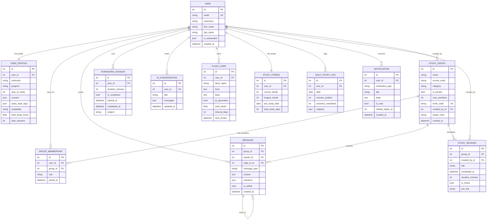
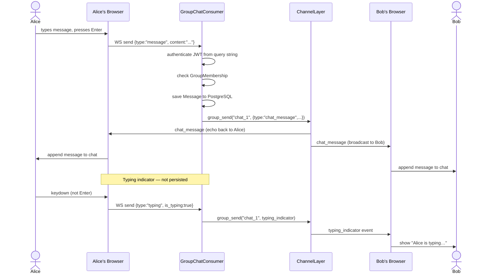
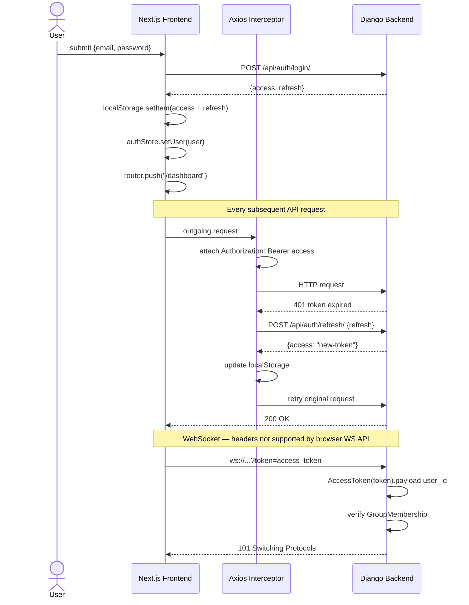
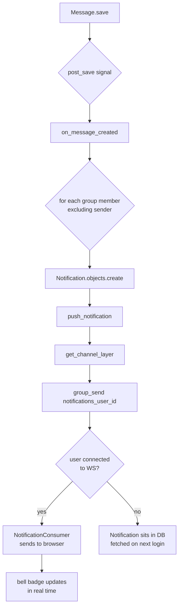
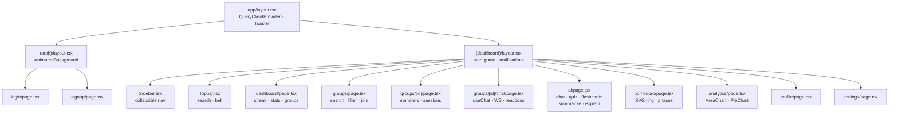

# StudySync — UML Reference

AI-powered study group platform. Full-stack: Django 6 + DRF + Channels (backend) · Next.js 16 + Tailwind v4 (frontend).

---

## 1. Entity-Relationship Diagram

Core database relationships across all eight Django apps.



---

## 2. Class Diagram

Django model class hierarchy with field types and key methods.

```mermaid
classDiagram
    class AbstractUser {
        <<Django>>
    }

    class User {
        +EmailField email
        +BooleanField is_onboarded
        +DateTimeField created_at
        USERNAME_FIELD = "email"
    }

    class UserProfile {
        +OneToOneField user
        +ImageField avatar
        +CharField university
        +CharField program
        +JSONField courses
        +JSONField study_style_tags
        +FloatField total_study_hours
        +IntegerField total_sessions
    }

    class StudyGroup {
        +CharField name
        +CharField course_code
        +CharField category
        +BooleanField is_private
        +IntegerField max_members
        +CharField invite_code
        +ForeignKey created_by
        +ManyToManyField members
        +save() void
    }

    class GroupMembership {
        +ForeignKey user
        +ForeignKey group
        +CharField role
        +DateTimeField joined_at
    }

    class Message {
        +ForeignKey group
        +ForeignKey sender
        +ForeignKey reply_to
        +TextField content
        +CharField message_type
        +JSONField reactions
        +BooleanField is_edited
    }

    class StudySession {
        +ForeignKey group
        +ForeignKey created_by
        +CharField title
        +DateTimeField scheduled_at
        +IntegerField duration_minutes
        +BooleanField is_online
        +URLField join_link
    }

    class PomodoroSession {
        +ForeignKey user
        +IntegerField duration_minutes
        +BooleanField is_completed
        +DateTimeField started_at
        +DateTimeField completed_at
        +CharField subject
    }

    class AIConversation {
        +ForeignKey user
        +CharField title
        +JSONField messages
    }

    class FlashCard {
        +ForeignKey user
        +CharField deck_name
        +TextField front
        +TextField back
        +BooleanField ai_generated
        +FloatField ease_factor
        +IntegerField interval_days
        +DateTimeField next_review
    }

    class StudyStreak {
        +OneToOneField user
        +IntegerField current_streak
        +IntegerField longest_streak
        +DateField last_study_date
        +IntegerField total_study_days
    }

    class DailyStudyLog {
        +ForeignKey user
        +DateField date
        +IntegerField minutes_studied
        +IntegerField sessions_completed
        +JSONField subjects
    }

    class Notification {
        +ForeignKey user
        +CharField notification_type
        +CharField title
        +BooleanField is_read
        +IntegerField related_object_id
    }

    AbstractUser <|-- User
    User "1" --> "1" UserProfile : profile
    User "1" --> "*" GroupMembership
    User "1" --> "*" Message : sent_messages
    User "1" --> "*" PomodoroSession
    User "1" --> "*" AIConversation
    User "1" --> "*" FlashCard
    User "1" --> "1" StudyStreak
    User "1" --> "*" DailyStudyLog
    User "1" --> "*" Notification
    StudyGroup "1" --> "*" GroupMembership : memberships
    StudyGroup "1" --> "*" Message
    StudyGroup "1" --> "*" StudySession
    Message --> Message : reply_to
```



---

## 3. System Architecture

How the three layers communicate at runtime.


---

## 4. WebSocket Message Flow

Real-time chat sequence from send to all connected clients.



---

## 5. Auth & JWT Flow

Login → token storage → auto-refresh lifecycle.



---

## 6. AI Streaming Flow

SSE word-by-word response from mock AI client to React typewriter.


---

## 7. Notification Signal Flow

How a new chat message auto-creates and pushes a notification.



---

## 8. Frontend Component Tree

React component hierarchy for the dashboard shell.



---

## Stack Reference

| Layer | Technology |
|---|---|
| Frontend | Next.js 16 · React 19 · TypeScript · Tailwind CSS v4 |
| State | Zustand (client) · React Query (server cache) |
| Backend | Django 6 · Django REST Framework · Django Channels 4 |
| Auth | JWT (simplejwt) · localStorage · Axios interceptors |
| Real-time | Daphne ASGI · WebSocket · InMemoryChannelLayer (dev) |
| Database | PostgreSQL (Postgres.app) |
| AI | Mocked SSE streaming — set `USE_MOCK_AI=False` + `OPENAI_API_KEY` for real OpenAI |

## Running Locally

```bash
# Backend (HTTP + WebSocket on one port)
export PATH="/Applications/Postgres.app/Contents/Versions/latest/bin:$PATH"
source venv/bin/activate
cd studysync-backend && daphne -p 8000 config.asgi:application

# Frontend
cd studysync-frontend && npm run dev

# Demo login
# Email:    alex@university.edu
# Password: StudySync2024!
```
