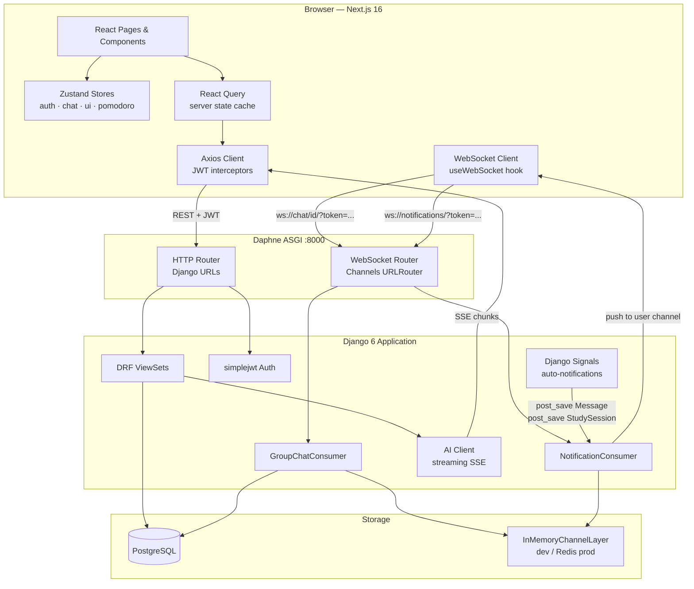
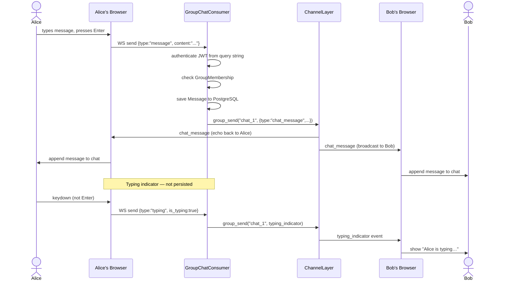
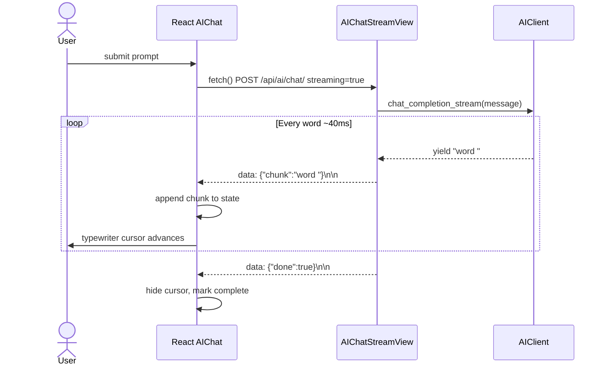
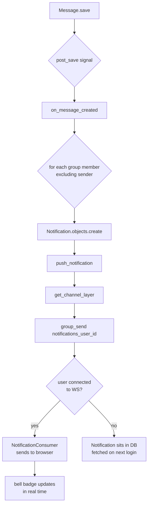

# StudySync

AI-powered study group platform. Full-stack: Django 6 + Channels (backend) · Next.js 16 + Tailwind v4 (frontend).

---

## Features

**Groups & Chat**
- Create and join study groups with course codes, categories, and privacy settings
- Real-time WebSocket group chat with typing indicators and emoji reactions
- Members sidebar, role badges (admin / member), and leave confirmation

**AI Study Tools**
- Streaming AI chat with a typewriter effect (mock by default, OpenAI when configured)
- Quiz generator — topic + difficulty, multiple-choice with explanations
- Flashcard generator with 3D flip animation
- Note summarizer and concept explainer

**Analytics & Pomodoro**
- Study streak, longest streak, total hours, and daily study log
- 7-day area chart and 30-day bar chart of study minutes
- Subject breakdown pie chart (populated from Pomodoro sessions)
- Circular SVG Pomodoro timer with work / short break / long break phase switching

**Other**
- Campus study spots directory with ratings, amenities, noise levels, and hours
- Notifications — real-time push via WebSocket + DB fallback for offline users
- User onboarding flow (university, program, study style tags, courses)
- Settings — notification toggles, password change, account danger zone
- Dark / light mode with zero flash (anti-flash inline script + CSS variable tokens)
- Fully responsive — collapsible sidebar on desktop, bottom tab bar on mobile
- Pricing page at `/pricing` with monthly/annual toggle

---

## Tech Stack

| Layer | Technology |
|---|---|
| Frontend | Next.js 16 · React 19 · TypeScript · Tailwind CSS v4 |
| State | Zustand (client) · React Query (server cache) |
| Animations | Framer Motion |
| Backend | Django 6 · Django REST Framework 3.17 · Django Channels 4 |
| Auth | JWT (simplejwt) · localStorage · Axios interceptors with auto-refresh |
| Real-time | Daphne ASGI · WebSocket · InMemoryChannelLayer (dev) / Redis (prod) |
| Database | PostgreSQL |
| AI | Mocked SSE streaming by default — set `USE_MOCK_AI = False` + `OPENAI_API_KEY` for real OpenAI |

---

## Project Structure

```
410Project/
├── studysync-backend/
│   ├── apps/
│   │   ├── users/          # Custom User, UserProfile, auth endpoints
│   │   ├── groups/         # StudyGroup, GroupMembership
│   │   ├── chat/           # Message, GroupChatConsumer (WebSocket)
│   │   ├── sessions_app/   # StudySession, PomodoroSession
│   │   ├── ai_assistant/   # AIConversation, FlashCard, streaming endpoints
│   │   ├── analytics/      # StudyStreak, DailyStudyLog
│   │   ├── campus/         # StudySpot
│   │   └── notifications/  # Notification, NotificationConsumer (WebSocket)
│   ├── config/             # Django settings, ASGI, URL root
│   ├── fixtures/           # Seed data
│   └── requirements.txt
│
└── studysync-frontend/
    ├── app/
    │   ├── (auth)/         # login, signup — AnimatedBackground layout
    │   ├── (dashboard)/    # dashboard, groups, ai, pomodoro, analytics,
    │   │                   # profile, settings, spots
    │   ├── onboarding/
    │   ├── pricing/
    │   └── not-found.tsx
    ├── components/
    │   ├── landing/        # Navbar, Hero, Features, HowItWorks, Testimonials, CTA
    │   ├── layout/         # Sidebar, Topbar, MobileNav
    │   ├── shared/         # GlassCard, AnimatedBackground, GradientText
    │   └── ui/             # Button, Avatar, Badge, Input, Skeleton, ThemeToggle
    ├── hooks/              # usePomodoro, useChat, useWebSocket
    ├── lib/
    │   ├── api/            # Axios client + per-domain API modules
    │   ├── store/          # Zustand stores (auth, ui, pomodoro, notifications)
    │   └── utils/          # cn, format, animations
    └── public/
```

---

## Running Locally

### Prerequisites

- Python 3.11+
- Node.js 20+
- [Postgres.app](https://postgresapp.com) (or any PostgreSQL instance)

### 1 — Database

```bash
# Start Postgres.app, then create the database
psql -c "CREATE DATABASE studysync;"
```

### 2 — Backend

```bash
export PATH="/Applications/Postgres.app/Contents/Versions/latest/bin:$PATH"

python -m venv venv
source venv/bin/activate
pip install -r studysync-backend/requirements.txt

cd studysync-backend
python manage.py migrate
python manage.py loaddata fixtures/*.json   # optional seed data

# Run (HTTP + WebSocket on one port via Daphne)
daphne -p 8000 config.asgi:application
```

### 3 — Frontend

```bash
cd studysync-frontend
npm install
npm run dev          # http://localhost:3000
```

### Demo credentials

```
Email:    alex@university.edu
Password: StudySync2024!
```

---

## Environment Variables

### Backend (`studysync-backend/config/settings.py`)

| Variable | Default | Description |
|---|---|---|
| `SECRET_KEY` | insecure dev key | Django secret key |
| `DEBUG` | `True` | Debug mode |
| `USE_MOCK_AI` | `True` | Use mock SSE responses instead of OpenAI |
| `OPENAI_API_KEY` | — | Required when `USE_MOCK_AI = False` |

### Frontend

No `.env` required for local dev. The Axios client points to `http://localhost:8000` by default.

---

## API Overview

All endpoints are under `/api/`. JWT access token required in `Authorization: Bearer <token>` header unless noted.

| Method | Path | Description |
|---|---|---|
| POST | `/api/auth/register/` | Sign up |
| POST | `/api/auth/login/` | Log in → `{access, refresh}` |
| POST | `/api/auth/refresh/` | Refresh access token |
| GET | `/api/users/me/` | Current user profile |
| PATCH | `/api/users/profile/` | Update profile |
| PATCH | `/api/users/change-password/` | Change password |
| GET/POST | `/api/groups/` | List / create study groups |
| POST | `/api/groups/:id/join/` | Join a group |
| POST | `/api/groups/:id/leave/` | Leave a group |
| GET | `/api/chat/:id/messages/` | Fetch message history |
| POST | `/api/ai/chat/` | Streaming AI chat (SSE) |
| POST | `/api/ai/quiz/` | Generate quiz |
| POST | `/api/ai/flashcards/` | Generate flashcards |
| POST | `/api/ai/summarize/` | Summarize notes |
| POST | `/api/ai/explain/` | Explain a concept |
| GET | `/api/analytics/streak/` | Study streak |
| GET | `/api/analytics/hours/` | Daily study hours |
| GET | `/api/analytics/subjects/` | Subject breakdown |
| GET | `/api/campus/spots/` | Study spots |
| GET | `/api/notifications/` | Notification list |
| PATCH | `/api/notifications/:id/read/` | Mark as read |

**WebSocket endpoints**

| Path | Description |
|---|---|
| `ws://localhost:8000/ws/chat/:id/?token=<jwt>` | Group chat |
| `ws://localhost:8000/ws/notifications/?token=<jwt>` | Live notifications |

---

## UML & Architecture Diagrams

### Entity-Relationship Diagram


---

### System Architecture



---

### WebSocket Message Flow



---

### Auth & JWT Flow


---

### AI Streaming Flow



---

### Notification Signal Flow



---

### Frontend Component Tree

```mermaid
graph TD
    Root["app/layout.tsx\nQueryClientProvider · Toaster · theme-init script"]
    Auth["(auth)/layout.tsx\nAnimatedBackground"]
    Dash["(dashboard)/layout.tsx\nauth guard · notifications"]
    Land["app/page.tsx\nLanding page"]
    Price["app/pricing/page.tsx"]

    Root --> Auth
    Root --> Dash
    Root --> Land
    Root --> Price

    Auth --> Login["login/page.tsx"]
    Auth --> Signup["signup/page.tsx"]

    Land --> LNav["Navbar"]
    Land --> LHero["HeroSection"]
    Land --> LFeat["FeaturesSection"]
    Land --> LHow["HowItWorksSection"]
    Land --> LTest["TestimonialsSection"]
    Land --> LCTA["CTASection"]

    Dash --> Sidebar["Sidebar\ncollapsible · logout"]
    Dash --> Topbar["Topbar\nsearch · notifications · theme · avatar→profile"]
    Dash --> MobileNav["MobileNav\nbottom tab bar md:hidden"]

    Dash --> DB["dashboard/page.tsx\ngreeting · streak · stats · groups · sessions"]
    Dash --> Groups["groups/page.tsx\nsearch · filter · join · create modal"]
    Dash --> GD["groups/[id]/page.tsx\nmembers · sessions · leave"]
    Dash --> Chat["groups/[id]/chat/page.tsx\nuseChat · WS · emoji · members panel"]
    Dash --> AI["ai/page.tsx\nchat · quiz · flashcards · summarize · explain"]
    Dash --> Pomo["pomodoro/page.tsx\nSVG ring · phase switching · subject input"]
    Dash --> Analy["analytics/page.tsx\nAreaChart · PieChart · BarChart"]
    Dash --> Prof["profile/page.tsx\nedit bio · stats · courses · study style"]
    Dash --> ProfU["profile/[userId]/page.tsx\npublic view"]
    Dash --> Sett["settings/page.tsx\ntoggles · password change · logout"]
    Dash --> Spots["spots/page.tsx\nstudy spots · ratings · amenities"]
```


